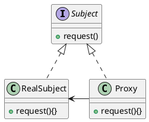
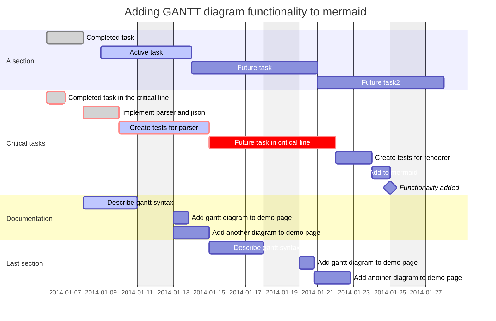
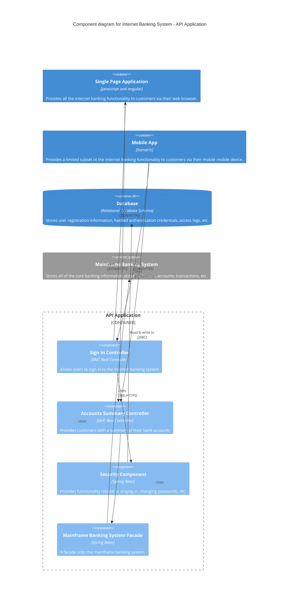

# Javascript 伪异步机制
[toc]
主要是 RevealJS + Html2canvas + jspdf 将网页 PPT 保存成 PDF 引发的对前端异步的思考。不逼逼那么多，直接贴代码
## 代码
```ts
() => {
    const pages = PDFS.current.querySelectorAll('div .display-slide')
    const pdf = new jsPDF('', 'pt', 'a4')
    let flag = 0

    function toSuccess(num) {
      const success = new Promise<void>(((resolve, reject) => {
        console.log(`第${num}页`)
        if (num === pages.length) {
          resolve()
          pdf.save(`${title}报告.pdf`)
        } else {
          reject()
        }
      }))
      return success
    }

    pages.forEach(page => {
      html2canvas(page, {
        useCORS: true,
      }).then((canvas) => {
        const pageData = canvas.toDataURL('image/jpeg', 1.0);
        const contentWidth = page.clientWidth
        const contentHeight = page.clientHeight
        const scale = 595.28 / contentWidth > 841.89 / contentHeight ? 841.89 / contentHeight : 595.28 / contentWidth
        pdf.addImage(pageData, 'JPEG', 0, position, contentWidth * scale, contentHeight * scale)
        toSuccess(++flag).then(
          () => console.log('遍历完成...开始下载'),
          () => {
            console.log('尚未遍历完成，添加一页，继续遍历')
            pdf.addPage()
          })
      })
    })
  }
```
中途思考过程不逼逼那么多，主要是做实验确定了 JavaScript 真的是单线程，异步的核心是伪异步。然后看到了一句话：原话是啥忘了，记得2个关键词，**伪异步**和**队列**。然后自己根据多年F12的经验，理了一下（上述代码的执行过程）：

1. 首先是执行主函数：然后将 foreach 里的循环方法丢到队列中
<img src='data:image/png;base64,iVBORw0KGgoAAAANSUhEUgAAAMwAAAFOCAYAAADKLfKVAAAAAXNSR0IArs4c6QAAAARnQU1BAACxjwv8YQUAAAAJcEhZcwAADsMAAA7DAcdvqGQAABBdSURBVHhe7d0LlqO4EoTh2o/Xw368Hq/H+/GQ4mEBAQk2SO7J/7tHZ7r8AOIeogXuAv+9AOxGYYADKAxwAIUBDqAwwAEUBjiAwgAHUBjgAAoDHEBhgAMoDHAAhQEOoDDAARQGOIDCAAdQGOAACgMcQGGAAygMcACFAQ6gMMABFAY4gMIAB1AY4AAKAxywWZi/vz9GPwBDYXYOwFCYnQMwFGbnAAyF2TkAc7gwEUTNDR+FEaLmho/CCFFzw0dhhKi54aMwQtTc8FEYIWpu+CiMEDU3fBRGiJobPgojRM0NH4URouaGj8IIUXPDR2GEqLnhozBC1NzwURgham74KIwQNTd8FEaImhs+CiNEzQ0fhRGi5oaPwghRc8NHYYSoueGjMELU3PBRGCFqbvgojBA1N3wURoiaGz4KI0TNDR+FEaLmho/CCFFzw0dhhKi54aMwQtTc8FEYIWpu+CiMEDU3fBRGiJobPgojRM0NH4URouaGj8IIUXPDR2GEqLnhozBC1NzwURihdu5H8/e63Z/9T9vstWp756N59G/AVyiMUD/349X83V47O7PueX/dbPtv99e3i0KHwgi/kPt5v+2eZZaer/vNtrtpq4czURihXG6bSZbr2h5DCbpSNI9+GeMx1/D48KPNMu17Hg0zzQkojFA/d1eC7fOOWTGsEOk978e78xsr2LPtDYU5A4UR6uf+oDCjlceZYU5BYYT6uT8rjJ33/DX37vG7HYplHxxQmFNQGKFk7rSTi/WtjfcHAe/CjMuwQjzbsg1F6g/T0vkNhTkFhRHq594/w3Tbl38aNp95stdRmK9RGKF+7s9P+rshPk5mhjkFhRHq5/7mpH8FhTkFhRHq5z56SLZzUJivURihVO69vwe2GLunlQwzzCkojBA1N3wURoiaGz4KI0TNDR+FEaLmho/CCFFzw0dhhKi54aMwQtTc8FEYIWpu+CiMEDU3fBRGiJobPgojRM0NH4URouaGj8IIUXPDR2GEcrntcuL+N4iH2yENfx4e3/wtY31NTPot6E9+oxkuCiOUzG07d9q3x8JMSzA+L60X5vObAGILhRHK5m5nGdvjsxvuvXf27kKyxfaMDaEwpVEYoVTuzTvG2GGYHY5lbehuo9T9nA67Ju+5ve52s77JY9mYtwofoTBC6dxpRmjamWVyA/J+dsnOX6ww05lj3wzDjHMeCiOUyj3MEmmHT4dks/W2JWrGO8CoclCY0iiMUDy3HXqpWyNNCmEzzvwrMLrnu21s2kOy7M6X2cIozHkojFAq9zDDqDHs8MN5S/pvdniWv3d87fM5Pk5hrkFhhJK58xP5JP/3mOT9SVn+so44JMsO7YaSUJjzUBihXO55GboCzHfubtbwDtk66bXpgfdzYykXZcRRFEaokXs4lJp//DuUpbH/Lv7Ff1aYVIjlV/2NheHeZF+jMELR3OmE39bR/c2fdu70564M75ml/3myw2eF6Q/F5KFXX5RHu2wOzb5DYYRSubvZYzkjtM90h2qz2cYMh1xdsYb3d8VZL8NQPrUuHEFhhKi54aMwQtTc8FEYIWpu+CiMEDU3fBRGiJobPgojRM0NH4URouaGj8IIUXPDR2GEqLnhozBC1NzwURgham74KIwQNTd8FEaImhs+CiNUyW2/nt//6v54bYwc2xeApfdyzctlKIxQPHd/LYv4bf4PdJcGnLMszFEYoWTu7rqWD65TGS88OzK4HuZbFEYolntyybBd5HVghz58ubG6TROOojBCjdzjdff4aRRGKJ47HV7l1/Qv1z8Z2cyy/QFBNvgg4BQURiiauz/h35xdskKhLgojFMs93OmlPXc5XJj02HI7vcFdY75DYYRSue1wynrinr/smWHsNdlhF+dE16AwQuncZxTGypfPHmqZlOh7FEYonfvrwqTnpx8Zq2WmDwgozFcojFA69zeF6T4lW/77ynKZ3s3+sAeFEUrnVoVJj+XbsPL8agGGT98mg3+4/BaFEaLmho/CCFFzw0dhhKi54aMwQtTc8FEYIWpu+CiMEDU3fBRGiJobPgojRM0NH4URouaGj8IIUXPDR2GEqLnhozBC1NzwURgham74KIxQPPfqr+9v3Rqp/y7/fOQ3uki/rexcpYnDKIxQOvf8asnB9nUy0zItlkFhLkFhhGK55TUrw44vZpA0hpLkhbE/z8phy+bWSqejMEKx3GIWGGYKfTnxvCTdn+VMZId5FOZ0FEYolnutMHbbJXk4pQqTP5bx7gOAj1AYoVjujRlG2z/DdJcwiyLhKxRGKJZ78xymu2nFtAdWkqFgujyDdEg3LgtnoTBCsdzuDGNFyH6evH5akuX72uce7es5jzkVhRGK5d51SNaVJs00OwuTDsdSUdQshW9QGKFY7l2FyYjCNI2dq9g26iK1C+TTshNRGKFY7k8KM+78s2Ik+mZ9tsz1fwDFERRGKJY7FWa5rrXCvA+1zLww9nP7flmMrkiU5nsURiiW25th0r+l5NsxL8jw857bwFKaM1AYIWpu+CiMEDU3fBRGiJobPgojRM0NH4URouaGj8IIUXPDR2GEqLnhozBC1NzwURgham74KIwQNTd8FEaImhs+CiNEzQ0fhRGi5oaPwgjFci9+G3k25hd+LS4G27qiUl0vg29RGKFGbnlvsZY9Pvl1/9XC9L++L7Y9H9uXAMBDYYTyuW1n17PBnsLcbo14LzPMFSiMUDy3vPKyu7BstTDpcuXm1aTCdFdiPmyWWiwnHxToWxRGKJ3brrKcHI1lxVgtjP25uY+HZI9mXgZmmCtQGKFo7smNLTp5SdYK0z3+eJ/DrNwfYDFm68IxFEYomXsxu8xmhrXCdO/b+pQMV6AwQrHcQwHG2aE9eW8Lkn9atnpIlkwLY69V2z4OmvU1CiOUyj0/7+h2+OVjRwozvnYmLZvCfI3CCHVy9x8Rz3b4o4VR2z4OCvM1CiPUyL3r7pTMMNVRGKFsbj2zSMww1VEYoVju/mR/cz+2kmTbMS0WM0xpFEb4d3I7hZmVjb58j8IIUXPDR2GEqLnhozBC1NzwURgham74KIwQNTd8FEaImhs+CiNEzQ0fhRGi5oaPwghRc8NHYYSoueGjMELU3PBRGCFqbvgojFAs96OZ/rLkjhtZ7LoMAJehMEKp3HYtf9Mue/wt4lSY7n5kil1kRmHqojBC0dzpV/D76/gpzM+jMELp3GMRKMzPozBCtdwU5udRGKFa7lSY5brzQWHqojBC6dx2aXE68R9nmOzS42zWYYapj8IIZXNbOawweRGy28U6h2koi8IIRXMvbp3UyktCYX4KhRHK5Z7e9WUwuSXSrDDcLqkuCiMUy61ml/zfZQyF+SkURiiV207i830/lWF2M/J5YTjxr4vCCDVyWxEWs03SHba9t4XzmZoojBA1N3wURoiaGz4KI0TNDR+FEaLmho/CCFFzw0dhhKi54aMwQtTc8FEYIWpu+CiMEDU3fBRGiJobPgojRM0NH4URouaGj8IIUXPDR2GEqLnhozBC1NzwURgham74KIwQNTd8FEaImhs+CiNEzQ0fhRGi5oaPwghRc8NHYYSoueGjMELU3PBRGCFqbvgojBA1N3wURoiaGz4KI0TNDR+FEaLmho/CCFFzw0dhhKi54aMwQtTc8FEYIWpu+CiMEDU3fBRGiJobPgojRM0NH4URouaGj8IIUXPDR2GEqLnhozBCzdw11on9KIxQK3et9WI/CiPUyl1rvdiPwgg1cqt12sBvoTBC6dxqfTbweyiMUDq3Wp+NUp732+vvdn89+59z6blxm26v++JFj1fTPtc8+h9d3evznJN1P++v21/Tvkp4NNP3zcc8g71+JdenKIxQMrdal41ynq/77e91a5vwaJbbYY9vUe9ZjEmbrDDv4tn7J+vYKkwmFVm01B4fl0dhyiiVW63HRlEbO+hiZ555l0W/v5ud5rNSXhj78+y9tj3uTm4lV7MdhamiVG61HhslbZXCe274G35ZjG7WWj+E6x6Xs8SenTyVfPr/2VBaClNBidxqHTaK6ne8w4Vpd8TF47ZzZjnWltm+sC/M9NBslJazfUhm2zU9ynsXg8JUcHVutXwbZQ2zwGczzJvt+Mss3VA7/vYMs5ytZsQhW14SClPB1bnV8m2UlHbMdme6D6WYzRCr49a8mr5o3diYDeaHTqkc+cyynGXSoV772q0STzs2XQaFqeDK3GrZNkrI1/douh19axbZN8P0du+c0x18uo7+ucfKif+wjrGIzetuxc8aRGEquCq3Wq6NM6nlqzH4tDD2nFquHNMTjtXCDLPes/2fHS7Ojtba105no/T62QxFYSq4Krdaro0j1Ps/GYNPCzOld3Az2YGTrjBNu/N32zIc0k2L5O/s3Trn20dhKrgit1qmDUW97uwxOKMw9rq1HXO5jFkxEr3zp+WqFra2nhtRmDKuyK2WWXMMtkqx9VxiO6Qtb3XHVTPPvDD289oyuvdPn9PlkihMGWfmVsuqNZR3Kfod1xu2824UJf3Nn79+scPmhdmz82el6U/2ZbcGw7b1Y1exDqAwwlm51XKuHrgWhRHOyq2Wc8ZAPRRGOCu3Ws6egd9FYYQzc6tl2cC/icIIZ+c+e3moh8IIZ+dWy7OBfw+FEa7IfcUyUR6FEa7IrZZpA/8WCiNclfuq5aIcCiNclVst1wb+HRRGuDL3lcvG9SiMcGVutWwb+DdQGOHq3Gr5NvD7KIxwdW61fBv4fRRGKJFbrcMGfhuFEUrkVuuwgd9GYYRSudV6bOB3URihVG61Hhv4XRRGKJlbrcsGfhOFEUrnLr0+fI7CCKVzq/XZwO+hMEKN3DXWieMojFAjt1qnDfwWCiPUyl1rvdiPwgi1cqv12sDvoDBCzdw11w0fhRFq5lbrtoHfQGGE2rlrrx/rKIxQO7davw3UR2GEX8j9C9uAJQoj/ELuX9gGLFEY4Vdy114/lr4vTPbV0md/ec1VvK97m2e2AZgvC9N9a9W/UpQBhcGnvitMml3mX/D5+ygMPvVdYdL3CVIYxPFxYRZf/pkXJzuvGcZ8/0zvv91fj3v/fe35l4fO37/4YtH+i0LH1wzf9Z6bfclptoyhMPad7moZ78feAzAfFyZRM0z/LbaTgvQFyM91xsItmzRbZl+ObId/3pvN54dtmJxbtdtw71c1rPv9fF+udhkmbddsAObkwqx/CND9bf7+W7zbaeczQ7fzL46WvHOltB3DsrKvqV4xzG754obtM25uhHVuYfqZRO6rs9eqnXZ4v1qvjXy54ww1jr4wW9vQS++dvYDCYI+fLMzWzt6+sz83yWanfIahMLjQuYXpd+bdh2Tzwmy8f7RY53zZ/jIoDD51cmGGHW/2N3x63fQxXZiV99usMTwwX1Y/o+RlXNuG9yLa10+eHN5DYbDt9MIk/U79HsvXrBXGDDv8OGavmzxvz6X1ZYdoZr4NWUEoDD71XWH+p6Lmho/CCFFzw0dhhKi54TtcmKgDMBRm5wAMhdk5AENhdg7AUJidAzDsCcABFAY4gMIAB1AY4AAKAxxAYYADKAxwAIUBDqAwwAEUBjiAwgAHUBjgAAoDHEBhgAMoDHAAhQF2e73+A6PiaPV35gn7AAAAAElFTkSuQmCC'>

2. 执行 foreach 函数，然后遍历执行各种 promise, html2canvas.then，其实Promise.then 只是一个Promise 的回调方法而已，这里为了好理解，把它拆开来了。 要执行的函数按照程序逻辑挨个全丢队列中：
<img src='data:image/png;base64,iVBORw0KGgoAAAANSUhEUgAAARkAAAFGCAYAAABeyOs1AAAAAXNSR0IArs4c6QAAAARnQU1BAACxjwv8YQUAAAAJcEhZcwAADsMAAA7DAcdvqGQAACLvSURBVHhe7Z0Jlvs4bsZ9nzpP3afOU/dIZp+e7q5sk+TNZJnJdogKSZAiAIKkbFOmTH+/9/C6LW4gBXym/JdUl7/54U/fMBgMdpRBZGAw2KEmRAYAAEYDkQEAHApEBgBwKBAZAMChQGQAAIcCkQEAHApEBgBwKBAZAMChQGQAAIcCkQEAHApEBgBwKBAZAMChQGQAAIcCkQEAHApEBgBwKBAZAMChQGQAAIdy+ds//Ok7GQAAjAYiAwA4FIgMAOBQIDIAgENxIvNnJzBkI7hcLjDYXQbWAiIDO52BtYDIwE5nYC0gMrDTGVgLiAzsdAbW4iEiA0ALxMvaQGTAdBAvawORAdNBvKwNRAZMB/GyNhAZMB3Ey9pAZMB0EC9rA5EB00G8rA1EBkwH8bI2EBkwnSHx8vXx/Rbbv318xYPn5vPd+fv+GT+tC0QGTOf+ePn8fnftnkVcEhCZG9EBc1vQgFfi7ngJu5i37yfTGIjMreiAuSlowEtxd7x8vrt2EJmzcvmFE5dkI9ABc1PQgJfinngJiSraM7Fhv9Mk0zkd2r99fH9+vFEd9/+bVun2vCzw9f3xxsov7+7CTUOXclYfSWS+0tjVPp6byy9+dAITbQR5sbIB0OLueLF2MuGYEpUoGvy3m02kSvVRfUZBYSLx9fHeLE8+iN+KnA8fcag0di6PguT6WAmIDJjO3fFSCEL9h2DaNeTdAiW63j2QYBRXMr3ffoIfqa8oOkUnmbSL4t0l/1YCIgOmc3e8aJGJOxYzv1VdK9FTe+1XMt7vthPaLIpMy4dIaKsqQGR2IBecDIAWd8fLQSLTEgjXMv7WwnZBfCcDkdmAyIDp3B0vWmSiAOy+XNIi02i/UYyp++73AZG5ER0wNwUNeCnujpdqwqudRKgnj9kiU2nvdyfpgO4r7ly4gNV8yF24+qIwtYHINPGLqg2AFnfHiyEygSgE2co6NZHxJJHYTNUT5b4sjMcunzzaByYqLyQy/+YEhmwEYkGjAdAC8bI2EBkwHcTL2kBkwHQQL2sDkQHTQbysDUQGTAfxsjYQGTAdxMvaQGTAdBAvawORAdM5Ll7sBx2t+1Oq+Jvs4v0xoZ3yNZu6PwZsQGTAdI6Ll7rINB8ZSOx6hgn0gMiA6RwXL7eLDN15a9xFDK4GIgOmc0S8lJc2TjA+9GMGzLgS+UcBtkcIvFBBbO4BIgOmc1y87NvJtHY2YUeD66W7gMiA6RwXL3eKDHvgsXhY0rLKg5avzuWXTlySjcBafABaHBcvJDLU77u7XPK7ko9CeEyRSa9uaO1irKeuQQFEBkzniHjxwpH6Szrx9fW1HW+KTBSYt7fOpRJEZheXX/7kBCbaCNKJ5QZAi+Pixbhc2l4ulYVFi4z/7Nt0f4+ByOwCIgOmc1y8lCITdjLhQC7bxCQIUBYNiMwYIDJgOsfFixKZICLlP0dvYuJFg/14C5EZA0QGTOe4eGEik35n0QrjieLi/4okL4fIjAEiA6ZzRLwEgQj9+Z0LiY0pMAEq13f4WiKT+43WEiEQgMiA6SBe1gYiA6aDeFkbiAyYDuJlbdYRmfAjHBv3RW7xXuE3AXHenIG1OJnIfIp7GvZCP8apX/md6NR/6HtG6M+e6vWByICz40Tm353AkI1AB8x1QXObyHT/bvESQGTAc3IqkeFthGiwW8GT8dzyyddOtvKPn4c7P4tLKqq3jSPKW2UO7aMrz8i20tVcVptC8c+mztJc/LxluXHfBvdN+B3/6XZPHweSxyUDa3H+nUz8rUUcVzdWBcHwY9WyNCZyU2TiOFrcPmKXrTJqy++xoOSlj8bYH2lcWZaPW1BdPUXpF9Up55V9C6Kylaf7Q4w+qms5nnDumIG1OLnIyCTk6N9hxDdxkSBlP1Jk8je6zVezzLctir0I+c6jIJrNW2UFNAddV+5MfJd8XQzfwphJdOK8m30cD48Vb2Atzi0yrSQsdg/EtqsRZR2R6SW7K2+V+bZ6zt6oTd4t6GTWZW0qIqMOCIHY61urjwegfQNrsZzIECl5U6IcLzLV8gRPeC02qawQIc7tIlP3DSIDjmeZy6WCIEKpvEwmeblUH4f4bJa12yqCX3bi144TN4hM1zeIDDie04mMTggKeJVcKlHfix1NRVRS4sT2fOdQGyd9bpWZbd0uIv33nTsXxo7+qrK8MyNxkMlvC0ZPIArf/O4mf4DIgMM5mcjk9iKZkihspkUlJiWz8ts7JpQvd0kldzIRPQ5PvlaZIyXzZq7vBAlcMuk7L8vH7eTnPqT57REI4ZuYM0QGHM/lV05cko1ABwyCBvRAvKwNRAZMB/GyNhAZMB3Ey9pcfvWzE5hoI9ABg6ABPRAvawORAdNBvKwNRAZMB/GyNhAZMB3Ey9pAZMB0EC9rA5HpoW/C0zfwgbsR6+sMrMXiImM/77MX885XJzrl3cTgWvianidewBFAZKrYzwqBMfBHGc4TL+AIlhYZ7YcQjPgaBF4uxSg+D9VUKFuIzOeiUn/Jri3X/nbam3Mxy+bAd4jJr2RgLV5zJxN/ZxHHYxJzwdgeXqxmJfXfFZk4nhY5+frOXjl/sDI+2LiNUfpRe8Wnp/2az8cAkXkdXlBkbGHwdJ9gLtVqh8hUnqje2FdeFAdRzK+MqL6cqlU2EYjM6/B6ItNKumLHkMmvZODlO0Sml+Q7y/WaJqN2Uaj8seIyqlU2D4jM6wCR4TREhkgJmxLkcSJTLedwQdKC0iqbAETmdXAi8x9OYMhGoANmbtAYIlMRBs+ulzUFIUp17EsdeblUH4+4t9wg/sZjClOr7IFAZF6HlxAZnaDpdxaRaEXy+bZ6V1OKCl1GMWGK/fDdQm289Pmmcr8zyRV2v+JTlMX1mU1YL2ZgLRYXGUdKemdCbNhxMusyiZKQ1yt3FOw3D28u8eVOJqLHE4rh6JQnodlM9U9il0zOpV5Gvs8m+0YG1mJ9kQGnB/GyNhAZMB3Ey9pcfu3EJdkIdMAgaEAPxMvaQGTAdBAvawORAdNBvKwNRAZMB/GyNpdffzmBiTYCHTAIGtAD8bI2EBkwHcTL2kBkwHQQL2sDkQHTQbysDUQGTAfxsjanEJnwbI1+ludgzOeLQODR5+PaeAHPBUQmfvYUDyE+2KezAJEBI3kikaEnokfFvhYZ/1k+YR2fwF5aaOw1hciAkUBk4mcL2tl0XmL11EBkwPGcSmTk5UpO7uIyxlnadZhto3jU+vPsFpmiTtzhqLEI9W4ZMWZ+4VXNr5pP8nhrDI/0r6YVV69pMY6Dv9LTm7UWO/rJZWRgLc4jMq5evlyJiSKCtvGty9vywN8qx/5Y41pCZ3KSbMQXS4nLKjde+tMlXx/vxQuhLHEo5pnGCP2rl2fF+aQq7TGoP+5f+8+f7FzT5Cdfr8LXG+YbCeeKGViL84iMSnj69uPfeo2EUG0pSeQ3pq5nteOUfcSk0Q60CImY+tBJSMh5Uh0uEuU6KPgYSpD67F9Ty89inDB+Ep498yWujRfwXJz2N5mrREYdrCYJO2bVSdDY7R1FjdAvm7tOzN48pZ+l6Hi6Y/hjlblJ9q+p8DOuhfQhGzXdN1+Pbg/WAiITPydoXCUwnq7IkH/CZ2sn05snH0fsDDy9MSJcBJpic5/I1NfCA5EBBEQmfvaEYzphN2h8vavYKH6j0HPYn3RpTqGM1++OoQj1+8Koy601leN01iIAkQHE04mMeemg2oZjV4pM+FxL1gj5pJLSJXL4rBN6202kPvcnHfX19v3m6uuxmmO4z70/fyLH37+m2k9zLbw/2TmIDAg8kcg4YpJ5S4lhtdUC4gn91URmS1bDVD/ch2Bs7JR4W7tQN83hCpFxn4Ig6LEd7THivFK52PXY4/P5tNbU8lP44k34C5EBxOU3X//5nWwEOmAQNKAH4mVtIDJgOoiXtYHIgOkgXtYGIgOmg3hZm6cSGesHyaOxfkQGYzkqXsA5uPzm75zARBuBDpiRQXMWkSn+VeXBPq2GWEtnYC0WFBn6599Rea9Fxn+W95VY95+AazgqXsA5gMh0sHYyGuveD7Cfo+IFnIOnFBl5uZKTu7iMcaZvMBN1onjU+vPsFpmiTtzhqLGIeKOaOWa+ia3mV80nebw1hkf6N0qUbyH7SAbW4vlExvWXL1diooiEs3cyRVt+l+9WOfbHGvdFxrizNd5FKy6r3HjP+96ZYwnngBlYi+cTGZXw9G3Pv6UbIqPakvC0dy49kSn7MESnh/X4QXOeVIeLRLkOCj6GEqTZHBUv4Bw8/W8yV4mMOmgJSOhvp8jQ2O0dRQ0SJ25KZDrzlH6WouPpjuGPVeZ2NHx20keIzGpAZG4UGVNgPF2RiZc+3GdrJ9ObJx8n/D/3pTdGJPYRztODxYb7cVS8gHMAkblBZMIxnbAbNL7eVWwYv6fIOewUGUeaUyjj9btjKEL9/u5rJHyoo+IFnINlRca8dFBtLQEJ/TVEJnyuCgxBPqmkdYkcPuuE3nYT14sM9TX+vTOPgI+S4iQZWIsFRcYRk8xbEpshIsMvL7SpfrgPwdjYSYS2dqHuDSLjPoXLIj22oz1GnFcqF7se3dMx8HlkP8jAWjyVyIB1gMi8DhAZMB3Ey9pAZMB0EC9rA5EB00G8rA1EBkwH8bI2l986cUk2Ah0wCBrQA/GyNhAZMB3Ey9pAZMB0EC9rA5EB00G8rI0Tmb84gSEbgQ4YBA3ogXhZG4gMmA7iZW0uv/17JzDRRqADBkEDeiBe1mYNkdEPIxoPDK6IfojyWRHnzhlYixOJzKd8XcFOak9hV9/n8pTY78iByIBn4OlFpvmCqGWAyIDn5TQiw+sL0TDe4cJzK7xPpZlslKC8T+s9MqneNo4ob5U5tI+uPCPbSldzWW0K4r0w0dJc/LxluX7fjIP7JvzO763p9nEweWwysBbn3snE31rE8Zg0KdG2ly/VsjQmclNk4jha3NKfMGmVUVv50iefvPTRGHv70yOyrP0nSaiunqL0i+qU88q+BVHZyqPIWH1U1/IYwvljBtbixCIjk5Cjf4cR38RFgpT9SJGx30SX+WqW+bZFsRch33kURLN5q6yA5qDryp2J75Kvi+FbGDOJTpx3s4/HwGPFG1iL84pMKwmL3QORXynJyzoi00t2V94q8231fL1Rm7xb0Mmsy9pUREYdEAKx17dWHw9C+wfWYimRIVLypkQ5XmSq5Qme8FpsUlkhQpzbRabuG0QGPIYlLpcKggil8jKZ5OVSfRzis1nWbqsIftmJXztO3CAyXd8gMuAxnEpkdEJQwKvkUon6XuxoKqKSEie25zuH2jjpc6vMbOt2Eem/1T89osryzozEQSa/LRg9gSh887ub/AEiAx7CiUQmtxXJlERhMy0qMSmZld/eMaF8uUsquZOJ6HF48rXKHCmZN3N9J0jgkknfeVk+bic/9yHNb49ACN/EnCEy4DGcSmTAa4J4WRuIDJgO4mVtIDJgOoiXtbn8zolLshHogEHQgB6Il7WByIDpIF7WBiIDpoN4WRuIDJgO4mVtIDJgOoiXtYHItNA34ekb+MAQxBo7A2uxsMjYz/vsxbzz1YlOeTcxuBa+pueJF3AUl9/9gxOYaCM4T9DcIzL2s0JgDPxRhvPECzgKJzJ/dQJDNoKzBI32QQhGfA0CL5diFJ+HaiqULUTmc1Gpv2TXlmt/O+3NuZhlc+A7xOQXN7AWy4pMSq4iqeLvLOJ4TGIuGNvDi9WspP67IhPH0yInX9/ZK+cPVsYHG7cxSj9qr/j0tF/z+RggMq/Fi4mMLQye7hPMpVrtEJnKE9Ub+8qL4iCK+ZUR1ZdTtcomApF5LV5LZFpJV+wYMvmVDLx8h8j0knxnuV7PZNQuCpU/VlxGtcrmAZF5LSAyiYbIEClhU4I8TmSq5RwuSFpQWmUTgMi8Frhciux6WVMQolTHvtSRl0v18Yh7yw3ibzymMLXKHghE5rVYXmR0gqbfWUSiFcnn2+pdTSkqdBnFhCn2w3cLtfHS55vK/c4kV9j9ik9RFtdnNmG9lIG1WFhkHCnpnQmxYcfJrMskSkJer9xRsN88vLnElzuZiB5PKIajU56EZjPVP4ldMjmXehn5PpvsWzawFmuLDDg9iJf1gciAqSBe1gciA6aCeFkfiAyYCuJlfSAyYCqIl/W5/N6JS7IRIGjANSBe1gciA6aCeFkfiAyYCuJlfSAyYCqIl/WByICpIF7WByIDpoJ4WZ/pIhOerdHP8hyM+XwRCDz6fFwbL+D5gMhEiocQH+zTWYDIgNFcfv+PTmCijeDaoNkX1PRE9KjY1yLjP8snrOMT2EsLjb2mEBkwGohMBdrZdF5i9dRAZMBjOI3IyMuVnNzFZYyztOsw20bxqPXn2S0yRZ24w1FjEerdMmLM/MKrml81n+Tx1hge6V9NK65e02IcB3+lpzdrLXb0k8uygbU4h8i4OvlyJSaKCNrGty5vywN/qxz7Y41rCZ3JSbIRXywlLqvceOlPl3x9vBcvhLLEoZhnGiP0r16eFeeTqrTHoP64f+0/f7JzTZOffL0KX2+YbyScK2VgLZzI/JcTGLIRXBs0VsLTtx//1mskhGpLSSK/MXU9qx2n7CMmjXagRUjE1IdOQkLOk+pwkSjXQcHHUILUZ/+aWn4W44Txk/DsmS9xbbyA5+McIqMi9iqRUQerScKOWXUSNHZ7R1Ej9MvmrROzN0/pZyk6nu4Y/lhlbpL9ayr8jGshfchGTffN12P1AdYCIsOgcZXAeLoiQ/4Jn62dTG+efByxM/D0xohwEWiKzX0iU18LD0QGZCAykXBMJ+wGja93FRvFbxR6DvuTLs0plPH63TEUoX5fGHW5taZynM5aBCAyIPNUImNeOqi24diVIhM+15I1Qj6ppHSJHD7rhN52E6nP/UlHfb19v7n6eqzmGO5z78+fyPH3r6n201wL7092DiIDNp5EZBwxybylxLDaagHxhP5qIrMlq2GqH+5DMDZ2SrytXaib5nCFyLhPQRD02I72GHFeqVzseuzx+Xxaa2r5KXzxJvyFyIDMdJEBrw3iZX0gMmAqiJf1gciAqSBe1ufygxOXZCNA0IBrQLysz9OIjPWD5NFYPyKDsRwVL+A8QGQaWCJT/KvKg31aDbGW0cBaLCYy9M+/o/Jei4z/LO8rse4/AddwVLyA8wCRaWDtZDTWvR9gP0fFCzgPTycy8nIlJ3dxGeNM32Am6kTxqPXn2S0yRZ24w1FjEfFGNXPMfBNbza+aT/J4awyP9G+UKN9C9jEbWIvnEhnXV75ciYkiEs7eyRRt+V2+W+XYH2vcFxnjztZ4F624rHLjPe97Z44lnANlYC2eS2RUwtO3Pf+WboiMakvC09659ESm7MMQnR7W4wfNeVIdLhLlOij4GEqQZnNUvIDz8NS/yVwlMuqgJSChv50iQ2O3dxQ1SJy4KZHpzFP6WYqOpzuGP1aZ29Hw2UkfycBaXH74Jycw0UZwVNBYQjFLZEyB8XRFJl76cJ+tnUxvnnyc8P/cl94YkdhHOEcPFhvuh44Vb2AtIDLxs2ePyIRjOmE3aHy9q9gwfk+Rc9gpMo40p1DG63fHUIT6/d3XSPhQOla8gbVYUmTMSwfV1hKQ0F9DZMLnqsAQ5JNKWpfI4bNO6G03cb3IUF/j3zvzCPgoKUa4gbVYTGQcMcm8JbEZIjL88kKb6of7EIyNnURoaxfq3iAy7lO4LNJjO9pjxHmlcrHr0T0dA59H9iMbWIunERmwDhCZ1wIiA6aCeFkfiAyYCuJlfZzI/LcTGLIRIGjANYyMlxF9gPFAZMBURsXLqH7AeCAyYCqj4mVUP2A8EBkwlRHxYvXhDZwDiAyYyr3xYrX3Bs7D5Q9OXJKNACccXMO98WK19/Yo9A2cHHFTpHrUg7Afg6kTb8DkxscON4zqmzYj+gZRbXoOvn5lXtcCkQFTuSderLbeHgfdoe3vLJd3UZNVn2GLWG0KEwrkRSaLlW8vxmiJDCOIn6Fs/vjWH0QGrMKt8WK18/ZQGkldCIAiC4zdnnZBevfDRcb/v2rr/ekKgxdGa1cFkWmjt4KDFufsWN9Gz4Y4b9H2YLXz9khaQtIrS+euFJP4/Fr18oqOm7uRPcJgPoNHYvUCIuMW8IacoZOkFN0tUOtb5PnwwVVeu7+qyFhtvD2UmKxXi4wVm+pLsh67SWSy2AhCP/bOKOH9EmHDxAQiU8F6tcN6QGQSVn1vjyXtNm4QGQGdVz0XMksssrhYOxn6wrV2QBHjcooLy/Iiw+uLk2Ns7/jahpPUTDY6kbzPsF0tFlCdcFHeKnNoH115RraVruay2hQocHJ7b2kuft6y3AhM7pvwO79WotvHgeRxs7Ww6nt7JGG93Fp+JCFRO5Gqvb1/v0dxImustY6pECA+XpKI8P8nQly7uiJ/GMUuRvWxvMiECesVjydPHI+LnxYjLWxdaCiR+cIXIhPHESfHjZP+wkCrjNryk03JSx+Nsbe/DCDL2n8xgOrqKUq/qE45r+xbEJWt3Po2jn1U13I84dwpq2HV9fYI+Hif7yQOPo5EXDBaZQW7E9qfn3w+5Rix7NPlh9VXGmMTr/fvDy+W7Fy/oMhQwFsnir5587eA+CYuEqTsR4pM/ka3+WqW+bZFsRch33k8oWbzVlkBzUHX1UEg18XwLYyZgjTOu9nH8fA4SWZh1fM2Eqt/yxK3ikyIP6Nf08QJjEISu+VjhPMWzqUdk5/vuZ2HznN5bPP5JUSmlYTqGzqRTx4v64hML9ldeauMvhVKozYxkf2x4oTJsjYVkVEHhEDs9a3VxwOw/LOw6nm7Bqv9LZboCUmtTGKLgkckfYBE5t0JBvmSzpMUn5AfTYGgMbV/x4nMH53ARBuBPiHe9nG/yBApefkJOFZkquUJnvD6xKWy5gm9XWTqvj2PyFh1vFlY9UZbYoTIiFhUlH0oMQnYghH6rZz8VtnGS4hMTCzrRHUTIYhQKi+TSZ7Y+jjEZ7Os3VYR/LITv3acoHF0eVsger49v8jMskQpAplWWSDGQj3Z6fzIYn9Oy1263Yd1fm1BMllVZPTkKeDVQqtErSk7X9wgKilx0sllC1gbJ31ulZlt3S4i/bf6lwFUWd6ZWYFjC4YOLi0QhW9+d5M/nF5krLJZZpGFJJ6znvm1TvGn1t1DccqsSHIuMnsEg53j7s7WkXyLtkuMdnAikcltxeTUxMvLpPIEl4sTF9uXu1UOJ1OfQD0OPxutMkdK5s1c3wkZONJ3XpaP28nPfUjzs/2QAiF8E3M+t8hYx482cAynEhnwetTixTo+wsDjgciAqdTixTq+x8D5gMiAqbTixSrzBp4LiAyYSi9eeuXg/EBkwFR68WKVewPPA0QGTGVPvOypA84LRAZMZU+8WHW8gefg8uMf/+c72QgQDOAa9sbL3nrgfEBkWuib8Io7MMG9iPWNZmHV8wbOz8IiQ3cC6xtn92Le+epEZ9St1q8MX9Nr4uWauuA8QGRMqC0E5Rj4owzXxItV1xs4N8uKjPZBCEZ8WIyXSzGKz0M1FcoWIvO5qNRfsmvLtb+d9uZczLI58B1i8otbC6u+N3BeXm8nE39nEcdjEnPB2B5erGYl9d8VmTieFjn5+s5eOX+wMj7YuI1R+lF7xaen/ZrPxwCReS1eTGRsYfB0n2Au1WqHyFSeqN7YV14UB1GMwhMF0uyiVTaRe0TGY7XxBs7Ja4lMK+mKHUMmv5KBl+8QmV6S7yzX65mM2kWh8seKy6hW2TwgMq8FRCbREBkiJWxKkMeJTLWcwwVJC0qrbAL3iozHaucNnA9cLkV2vawpCFGqY1/qyMul+njEveUG8TceU5haZQ8EIvNaXH78Zycw0UZwnhNvJ2j6nUUkWpF8vq3e1ZSiQpdRTJhiP3y3UBsvfb6p3O9McoXdr/gUZXF9ZhPWS9lerLbewLlYWGQcKemdCbFhx8msyyRKQl6v3FGw3zy8ucSXO5mIHk8ohqNTnoRmM9U/iV0yOZd6Gfk+m+xbtmu4tz04nrVFBpyee+PFau8NnAeIDJjKiHgZ0Qc4DogMmMqIeLH68AbOAUQGTGVUvIzqB4wHIgOmMiperH68gflAZMBURsbLyL7AOCAyYCoj48XqyxuYC0QGTGV0vIzuD9wPRAZMZXS8WP15A/O4/OTEJdkIcILBNRwRL0f0CW4HIgOmckS8HNEnuJ3pIhOerdHP8hyM+XwRCDz6fFwbL3sZ3R+4HYhMpHgI8cE+nYVVRAacBycy/+sEhmwE1wbNvqCmJ6JHxb4WGf9ZPmEdn8BeWmjsNYXIgNFAZCrQzqbzEqunBiIDHsNpREZeruTkLi5jnKVdh9k2iketP89ukSnqxB2OGotQ75YRY+YXXtX8qvkkj7fG8Ej/alpx9ZoW4zj4Kz29WWuxo59clg2sxTlExtXJlysxUUTQNr51eVse+Fvl2B9rXEvoTE6SjfhiKXFZ5cZLf7rk6+O9eCGUJQ7FPNMYoX/18qw4n1SlPQb1x/1r//mTnWua/OTrVfh6w3wj4VwpA2txDpFRCU/ffvxbr5EQqi0lifzG1PWsdpyyj5g02oEWIRFTHzoJCTlPqsNFolwHBR9DCVKf/Wtq+VmME8ZPwrNnvsS18QKej1P+JnOVyKiD1SRhx6w6CRq7vaOoEfpl89aJ2Zun9LMUHU93DH+sMjfJ/jUVfsa1kD5ko6b75uux+gBrAZFh0LhKYDxdkSH/hM/WTqY3Tz6O2Bl4emNEuAg0xeY+kamvhQciAzKXn/7FCUy0EVwbNGcRmXBMJ+wGja93FRvFbxR6DvuTLs0plPH63TEUoX5fGHW5taZynM5aBCAyIPNUImNeOqi24diVIhM+15I1Qj6ppHSJHD7rhN52E6nP/UlHfb19v7n6eqzmGO5z78+fyPH3r6n201wL7092DiIDNp5EZBwxybylxLDaagHxhP5qIrMlq2GqH+5DMDZ2SrytXaib5nCFyLhPQRD02I72GHFeqVzseuzx+Xxaa2r5KXzxJvyFyIDMdJEBrw3iZX0gMmAqiJf1gciAqSBe1gciA6aCeFmfpxEZ6wfJo7F+RAZjOSpewHmAyDSwRKb4V5UH+7QaYi2jgbVYTGTon39H5b0WGf9Z3ldi3X8CruGoeAHn4fKzE5dkIzgqaM4gMhbWvR9gP0fFCzgPTycy8nIlJ3dxGeNM32Am6kTxqPXn2S0yRZ24w1FjEfFGNXPMfBNbza+aT/J4awyP9G+UKN9C9jEbWIvnEhnXV75ciYkiEs7eyRRt+V2+W+XYH2vcFxnjztZ4F624rHLjPe97Z44lnANlYC2eS2RUwtO3Pf+WboiMakvC09659ESm7MMQnR7W4wfNeVIdLhLlOij4GEqQZnNUvIDz8NS/yVwlMuqgJSChv50iQ2O3dxQ1SJy4KZHpzFP6WYqOpzuGP1aZ29Hw2UkfycBaQGTiZ89ekTEFxtMVmXjpw322djK9efJxwv9zX3pjRGIf4Rw9WGy4HzpWvIG1gMjEz549IhOO6YTdoPH1rmLD+D1FzmGnyDjSnEIZr98dQxHq93dfI+FD6VjxBtZiSZExLx1UW0tAQn8NkQmfqwJDkE8qaV0ih886obfdxPUiQ32Nf+/MI+CjpBjhBtbCicz/OYEhG8FRQbNPZBwxybwlsRkiMvzyQpvqh/sQjI2dRGhrF+reIDLuU7gs0mM72mPEeaVysevRPR0Dn0f2IxtYi6cRGbAOEJnXAiIDpoJ4WR+IDJgK4mV9Lj//qxOYaCNA0IBrQLysD0QGTAXxsj4QGTAVxMv6QGTAVBAv6wORAVNBvKwPRAZMBfGyPhAZMBXEy/pAZMBUEC/r8xCRgcGuMbAWly8nLslGYAUNDLbHwJpAZGCnMbAmEBnYaQysCUQGdgoD6zJcZAAAgAORAQAcCkQGAHAoEBkAwKFAZAAAhwKRAQAcCkQGAHAouEEBAHAoEBkAwIF8f/8/W3YVCfTdcL0AAAAASUVORK5CYII='>

3. 然后按照队列先进先出的原则依次调用方法，每调用完一个 html2canvs以及它的回调方法，然后是toSuccess和它的回调方法，以上就是这串代码的伪异步机制

||飞行行为|叫喊行为|游泳行为|
|:-:|:-:|:-:|:-:|
|野鸭|T|嘎嘎叫|T|
|家鸭|F|呱呱叫|T|
|玩具鸭|F|吱吱叫|T|
|木鸭|F|F|T|
|铁鸭/石头鸭|F|F|F|


||分辨率|音响|收视软件|
|:-:|:-:|:-:|:-:|
|液晶电视|最高支持分辨率1980*1024|内置杜比音响|云OS|
|显像管电视|最高支持分辨率1280*800|外接音响|收视天线|

```makefile
+ assembly
    -src
    -pom.xml
+ bin
    -migration
    -patch
    -start.sh
+ config
+ davinci-ui
+ docs
+ lib
+ logs
+ server
    - src
+ userfile
+ webapp
+ pom
```

```properties
D:\Program Files\apache-maven-3.3.9
M2_HOME=D:\Program Files\apache-maven-3.3.9
path=%SYSTEMROOT%\System32\WindowsPowerShell\v1.0\;%JAVA_HOME%\bin;%M2_HOME%\bin
```
&emsp;同样打开windows cmd命令窗口进行验证:
```powershell
PS C:\Users\admin>mvn -version
Apache Maven 3.3.9 (bb52d8502b132ec0a5a3f4c09453c07478323dc5; 2015-11-11T00:41:47+08:00)
```

```xml
    <dependencies>
        <dependency>
            <groupId>org.springframework.cloud</groupId>
            <artifactId>spring-cloud-starter-netflix-eureka-server</artifactId>
            <version>2.1.1.RELEASE</version>
        </dependency>
    </dependencies>

    <dependencyManagement>
        <dependencies>
            <dependency>
                <groupId>org.springframework.cloud</groupId>
                <artifactId>spring-cloud-dependencies</artifactId>
                <version>${spring-cloud.version}</version>
                <type>pom</type>
                <scope>import</scope>
            </dependency>
        </dependencies>
    </dependencyManagement>
```

```yaml
server:
  port: 1111

eureka:
  instance:
    hostname: localhost
  client:
    register-with-eureka: false
    fetch-registry: false
    service-url:
      defaultZone:  http://${eureka.instance.hostname}:${server.port}/eureka/

spring:
  application:
```


```typescript
@connect(({ tests, loading }: any) => ({
  tests,
  loading: loading.effects['tests/fetch'],
}))
class test extends Component{
    public componentDidMount: any = (): void => {
    const { dispatch } = this.props;
    if (dispatch) {
      dispatch({
        type: 'tests/getData',
        payload: 'do something...',
      });
    }
  };
}
```

```js
import {parse} from 'babylon';
import generate from 'babel-generator';

const a = 'var a = 1;';
const b = 'var b = 2;';
const astA = parse(a, { sourceFilename: 'a.js' });
const astB = parse(b, { sourceFilename: 'b.js' });
const ast = {
  type: 'Program',
  body: [].concat(astA.program.body, astB.program.body)
};

const { code, map } = generate(ast, { sourceMaps: true }, {
  'a.js': a,
  'b.js': b
});
```

```shell
$ npm i --save lodash
$ npm i --save-dev babel-plugin-lodash @babel/cli @babel/preset-env
```

```json5
rules: [
      {
        test: /\.(png|jpg|gif)$/,
        use: [
          {
            loader: 'file-loader',
            options: {
              name: '[path][name].[ext]',
            },
          },
        ],
      },
    ]
```

```txt
man-of-war: 战争之人
forget-me-not: 别忘记我
son-in-law: 女婿-> 在规矩里面的儿子
mother-in-law: 婆婆、岳母 -> 规矩里面的妈妈
commander-in-chief: 总司令、统帅 -> 负责人、司令官里最重要的
editor-in-chief: 总编辑、主编 -> 编辑里面最重要的
merry-go-round: 旋转木马、走马灯 -> 愉快的走着旋转
hide-and-seek: 捉迷藏 -> 藏和找
stay-at-home: 看家、宅、不爱出门的人 -> 呆在家里的人
jack-in-the-box: 玩偶匣 -> jack在盒子里
```

```groovy
dependencies {
    compileOnly 'org.projectlombok:lombok'
    annotationProcessor 'org.projectlombok:lombok'

    testCompileOnly 'org.projectlombok:lombok'
    testAnnotationProcessor 'org.projectlombok:lombok'
}
```

```java
public static double totalArea( Shape[] arr){
    double total = 0;
    for(Shape s: arr){
        if(s!=null){
            total += s.area();
        }
    }
    return total;
}
```

```yml
spring:
  jpa:
    show-sql: true  //打印日志
    hibernate:
      naming:
        physical-strategy: org.hibernate.boot.model.naming.PhysicalNamingStrategyStandardImpl //使用@Column 注解上的字段名
    properties:
      hibernate:
        dialect: org.hibernate.dialect.Oracle10gDialect //Oracle 方言化SQL。
```

```html
<html><head><title>Login Page</title></head><body onload='document.f.username.focus();'>
<h3>Login with Username and Password</h3><form name='f' action='/login' method='POST'>
<table>
	<tr><td>User:</td><td><input type='text' name='username' value=''></td></tr>
	<tr><td>Password:</td><td><input type='password' name='password'/></td></tr>
	<tr><td colspan='2'><input name="submit" type="submit" value="Login"/></td></tr>
	<input name="_csrf" type="hidden" value="635780a5-6853-4fcd-ba14-77db85dbd8bd" />
</table>
</form></body></html>
```

```log
test.start(): now: 1621320640
connectSourceServer: start 1621320640069
connectSourceServer: isOK: true now: 1032
connectAdvertTelecomServer: start 1621320641101
connectAdvertTelecomServer: isOK: true now: 1043
connectAdvertMobileServer: start 1621320642144
connectAdvertMobileServer: isOK: true now: 3004
connectCommonDestServer: start 1621320645148
connectCommonDestServer: isOK: true now: 22004
connectDestServer: start 1621320667152
connectDestServer: isOK: true now: 1027
connectAdvertUnicomServer: start 1621320668179
connectAdvertUnicomServer: isOK: true now: 3003
connectYNMobileServer: start 1621320671182
connectYNMobileServer: isOK: true now: 3005
connectTelecomServer: start 1621320674187
connectTelecomServer: isOK: true now: 22005
connectMobileServer: start 1621320696192
connectMobileServer: isOK: true now: 22004
connectUnicomServer: start 1621320718196
connectUnicomServer: isOK: true now: 22004
connectIptvServer: start 1621320740200
connectIptvServer: isOK: true now: 3004

Process finished with exit code -1
```

```py
import re

txt = "China is a great country"
x = re.search("^China.*country$", txt)
if (x):
  print("YES! We have a match!")
else:
  print("No match")
# YES! We have a match!
```

```git
{
+  "extraBabelPlugins": [
+    ["import", { "libraryName": "antd", "libraryDirectory": "es", "style": "css" }]
+  ]
}
```

```jsx
<Route path='/user/:data' component={UserPage}></Route>
```

```tsx
<Route path='/user' component={UserPage}></Route>
```

```sql
# 简单创建
create 'Student','StuInfo','Grades'
# 创建了名为 Student 的表，表中包含两个列族，分别为 Stulnfo 和 Grades。

# 详细创建
create 'Student', {NAME => 'Stulnfo', VERSIONS => 3}, {NAME =>'Grades', BLOCKCACHE => true}
# NAME、VERSION 和 BLOCKCACHE 是参数名，无须使用单引号，符号=>表示将后面的值赋给指定参数。例如，VERSIONS => 3是指此单元格内的数据可以保留最近的 3 个版本，BLOCKCACHE => true指允许读取数据时进行缓存。
```

```apacheconf
# 主要服务器
masters="ds1,ds2"
# 集群工作服务器
workers="ds1:default,ds2:default,ds3:default,ds4:default"
# 报警服务器，ds1-4随便选一台
alertServer="ds3"
# 网关服务器，ds1-4随便选一台
apiServers="ds1"
# python网关服务器，ds1-4随便选一台
pythonGatewayServers="ds1"

# ---------------------------------------------------------
# DolphinScheduler ENV
# ---------------------------------------------------------
# JAVA_HOME, we recommend use same JAVA_HOME in all machine you going to install DolphinScheduler
# and this configuration only support one parameter so far.
javaHome="/opt/hadoop/jdk1.8.0_172"

# DolphinScheduler API service port, also this is your DolphinScheduler UI component's URL port, default value is 12345
apiServerPort="12345"
```

```c
//C
int f(int x){
    if(x==0){
        return 0;
    }else{
        return 2*f(x-1)+x*x;
    }
}
```

```http
GET /zoos：列出所有动物园 HTTP/1.1
POST /zoos：新建一个动物园 HTTP/1.1
GET /zoos/ID：获取某个指定动物园的信息 HTTP/1.1
PUT /zoos/ID：更新某个指定动物园的信息（提供该动物园的全部信息） HTTP/1.1
PATCH /zoos/ID：更新某个指定动物园的信息（提供该动物园的部分信息） HTTP/1.1
DELETE /zoos/ID：删除某个动物园 HTTP/1.1
GET /zoos/ID/animals：列出某个指定动物园的所有动物 HTTP/1.1
DELETE /zoos/ID/animals/ID：删除某个指定动物园的指定动物 HTTP/1.1
```

```bash
# vi /root/.bash_profile

export JAVA_HOME=/usr/local/jdk1.8.0_74
export PATH=$JAVA_HOME/bin:$PATH
```


```plantuml
interface RedisSerializer {
    byte[] serialize(@Nullable T t) throws SerializationException;
    T deserialize(@Nullable byte[] bytes) throws SerializationException;
}
class CustomizeObjectToStringSerializer{
    byte[] serialize(RedisSerializerDto redisSerializerDto) throws SerializationException {实现实际的序列化方法}
    RedisSerializerDto deserialize(byte[] bytes) throws SerializationException {实现实际的返序列化方法}
}
class RedisTemplate
abstract RedisSerializerDto{
    public abstract String serialize();
    public abstract T deserialize(@Nullable String bytes);
}
class UserInfo{
    public abstract String serialize(){对于该实体特有的序列化方法}
    public abstract UserInfo deserialize(@Nullable String bytes){对于该实体特有的反序列化方法};
}

CustomizeObjectToStringSerializer .up.|> RedisSerializer: 实现序列化器
RedisTemplate --> RedisSerializer: 内部拥有实际的序列化器
CustomizeObjectToStringSerializer -down-> RedisSerializerDto: 维护一组带有自定义正反序列化的实体
UserInfo -up-> RedisSerializerDto: 继承需要实现的序列化和反序列化方法
```



```flow
st=>start: Start
e=>end
op1=>operation: My Operation
sub1=>subroutine: My Subroutine
cond=>condition: Yes
or No?:>http://www.google.com
io=>inputoutput: catch something
st->op1->cond
cond(yes)->io->e
cond(no)->sub1(right)->op1
```

```flowchart
st=>start: Start
e=>end
op1=>operation: My Operation
sub1=>subroutine: My Subroutine
cond=>condition: Yes
or No?:>http://www.google.com
io=>inputoutput: catch something
st->op1->cond
cond(yes)->io->e
cond(no)->sub1(right)->op1
```

```flowcharts
st=>start: Start
e=>end
op1=>operation: My Operation
sub1=>subroutine: My Subroutine
cond=>condition: Yes
or No?:>http://www.google.com
io=>inputoutput: catch something
st->op1->cond
cond(yes)->io->e
cond(no)->sub1(right)->op1
```




```vega
{
  "$schema": "https://vega.github.io/schema/vega/v5.json",
  "description": "A scatter plot with trend line calculated via locally-weighted (loess) regression.",
  "padding": 5,
  "width": 500,
  "height": 500,
  "autosize": "pad",

  "signals": [
    {
      "name": "loessBandwidth", "value": 0.3,
      "bind": {"input": "range", "min": 0.05, "max": 1}
    },
    {
      "name": "groupby", "value": "none",
      "bind": {"input": "select", "options": ["none", "genre"]}
    }
  ],

  "data": [
    {
      "name": "movies",
      "url": "https://vega.github.io/vega/data/movies.json",
      "transform": [
        {
          "type": "filter",
          "expr": "datum['Rotten Tomatoes Rating'] != null && datum['IMDB Rating'] != null"
        }
      ]
    },
    {
      "name": "trend",
      "source": "movies",
      "transform": [
        {
          "type": "loess",
          "groupby": [{"signal": "groupby === 'genre' ? 'Major Genre' : 'foo'"}],
          "bandwidth": {"signal": "loessBandwidth"},
          "x": "Rotten Tomatoes Rating",
          "y": "IMDB Rating",
          "as": ["u", "v"]
        }
      ]
    }
  ],

  "scales": [
    {
      "name": "x",
      "type": "linear",
      "domain": {"data": "movies", "field": "Rotten Tomatoes Rating"},
      "range": "width"
    },
    {
      "name": "y",
      "type": "linear",
      "domain": {"data": "movies", "field": "IMDB Rating"},
      "range": "height"
    }
  ],

  "marks": [
    {
      "type": "symbol",
      "from": {"data": "movies"},
      "encode": {
        "enter": {
          "x": {"scale": "x", "field": "Rotten Tomatoes Rating"},
          "y": {"scale": "y", "field": "IMDB Rating"},
          "fillOpacity": {"value": 0.5},
          "size": {"value": 16}
        }
      }
    },
    {
      "type": "group",
      "from": {
        "facet": {
          "data": "trend",
          "name": "curve",
          "groupby": "Major Genre"
        }
      },
      "marks": [
        {
          "type": "line",
          "from": {"data": "curve"},
          "encode": {
            "enter": {
              "x": {"scale": "x", "field": "u"},
              "y": {"scale": "y", "field": "v"},
              "stroke": {"value": "firebrick"}
            }
          }
        }
      ]
    }
  ]
}
```

```vega-lite
{
  "$schema": "https://vega.github.io/schema/vega-lite/v5.json",
  "config": {"view": {"stroke": ""}},
  "width": 800,
  "height": 200,
  "data": {
    "values": [
      {"country": "Great Britain", "animal": "pigs"},
      {"country": "Great Britain", "animal": "pigs"},
      {"country": "Great Britain", "animal": "cattle"},
      {"country": "Great Britain", "animal": "cattle"},
      {"country": "Great Britain", "animal": "cattle"},
      {"country": "Great Britain", "animal": "sheep"},
      {"country": "Great Britain", "animal": "sheep"},
      {"country": "Great Britain", "animal": "sheep"},
      {"country": "Great Britain", "animal": "sheep"},
      {"country": "Great Britain", "animal": "sheep"},
      {"country": "Great Britain", "animal": "sheep"},
      {"country": "Great Britain", "animal": "sheep"},
      {"country": "Great Britain", "animal": "sheep"},
      {"country": "Great Britain", "animal": "sheep"},
      {"country": "Great Britain", "animal": "sheep"},
      {"country": "United States", "animal": "pigs"},
      {"country": "United States", "animal": "pigs"},
      {"country": "United States", "animal": "pigs"},
      {"country": "United States", "animal": "pigs"},
      {"country": "United States", "animal": "pigs"},
      {"country": "United States", "animal": "pigs"},
      {"country": "United States", "animal": "cattle"},
      {"country": "United States", "animal": "cattle"},
      {"country": "United States", "animal": "cattle"},
      {"country": "United States", "animal": "cattle"},
      {"country": "United States", "animal": "cattle"},
      {"country": "United States", "animal": "cattle"},
      {"country": "United States", "animal": "cattle"},
      {"country": "United States", "animal": "cattle"},
      {"country": "United States", "animal": "cattle"},
      {"country": "United States", "animal": "sheep"},
      {"country": "United States", "animal": "sheep"},
      {"country": "United States", "animal": "sheep"},
      {"country": "United States", "animal": "sheep"},
      {"country": "United States", "animal": "sheep"},
      {"country": "United States", "animal": "sheep"},
      {"country": "United States", "animal": "sheep"}
    ]
  },
  "transform": [
    {
      "calculate": "{'cattle': '🐄', 'pigs': '🐖', 'sheep': '🐏'}[datum.animal]",
      "as": "emoji"
    },
    {"window": [{"op": "rank", "as": "rank"}], "groupby": ["country", "animal"]}
  ],
  "mark": {"type": "text", "baseline": "middle"},
  "encoding": {
    "x": {"field": "rank", "type": "ordinal", "axis": null},
    "y": {"field": "animal", "type": "nominal", "axis": null, "sort": null},
    "row": {"field": "country", "header": {"title": ""}},
    "text": {"field": "emoji", "type": "nominal"},
    "size": {"value": 65}
  }
}
```